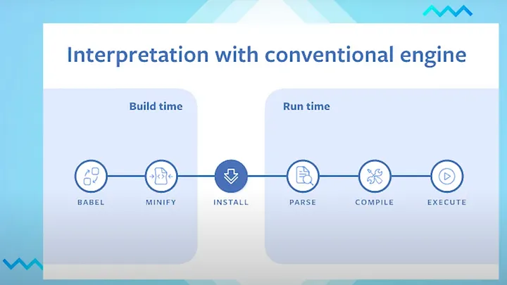
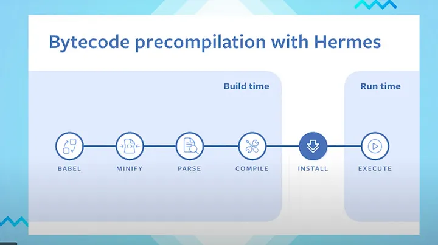

## React Native Architectures: Old vs. New (In-Depth Comparison)

At its core, React Native's purpose is to allow developers to write mobile applications using JavaScript and React, while still leveraging native platform capabilities and rendering native UI components. The challenge lies in how the JavaScript world communicates with the Native (Java/Kotlin for Android, Objective-C/Swift for iOS) world. This communication mechanism is the heart of the React Native architecture.

### 1. The "Old" Architecture (Legacy / Bridge-Based)

This was the original architecture React Native launched with.

**Core Concept:** Communication happens **asynchronously** across a **Bridge**.

**Key Components:**

1.  **JS Thread:** Where your JavaScript code (React components, business logic, framework code) runs. It executes on a JavaScript engine (like JavaScriptCore (JSC) by default, or Hermes if enabled).
2.  **Native Thread (Main/UI Thread):** Where the native platform code runs. This thread is responsible for rendering the UI, handling user gestures, and executing native module calls. There's typically only *one* UI thread per platform, and it's crucial to keep it responsive to avoid UI freezes.
3.  **Shadow Thread/Tree (Background Thread):** Introduced later to offload layout calculations. React generates a tree of UI elements. This tree is translated into a "Shadow Tree" (using Yoga layout engine) on a background thread. Yoga calculates the layout (positions and sizes) without blocking the JS or UI thread. The calculated layout information is then passed to the Native/UI thread for rendering.
4.  **The Bridge:** The central piece facilitating communication.
    *   **Mechanism:** It acts like a message queue or bus.
    *   **Data Flow (JS -> Native):** When JS needs to interact with the native side (e.g., render a `<View>`, call a native module like `CameraRoll`), it serializes the instructions into a JSON message. This message is put onto the Bridge. The native side picks up this message, deserializes it, and executes the corresponding native code.
    *   **Data Flow (Native -> JS):** When native events occur (e.g., user taps a button, a native module completes an operation), the native side serializes the event data into JSON, sends it across the Bridge, and the JS thread receives and processes it.
    *   **Serialization:** All data crossing the bridge *must* be serialized (typically to JSON strings) and then deserialized on the other side.

**Diagrammatic Representation (Conceptual):**

**Limitations of the Bridge Architecture:**

1.  **Asynchronous Nature:** All communication is inherently asynchronous. JS cannot directly call a native method and get an immediate result. This requires callbacks, Promises, or `async/await`, which adds complexity and can lead to timing issues if not handled carefully. You can't, for instance, easily ask the native side for the size of a View synchronously during a JS calculation.
2.  **Serialization Overhead:** Converting data to JSON strings and back is computationally expensive, especially for large or frequent data transfers. This impacts performance.
3.  **Bridge Bottleneck:** All communication funnels through this single bridge. High traffic (e.g., rapid UI updates, frequent native module calls) can congest the bridge, leading to delays and dropped frames.
4.  **"Message Batches":** To optimize, messages are often batched. This introduces latency – a message might wait a short time before being sent across the bridge.
5.  **Memory Overhead:** Maintaining multiple copies of data (JS object, JSON string, Native object) increases memory usage.
6.  **Initialization Cost:** Native Modules often needed to be initialized eagerly at app startup, even if not immediately used, increasing startup time.

---

### 2. The "New" Architecture (JSI - JavaScript Interface)

This is the modern architecture being rolled out, designed to overcome the limitations of the Bridge.

**Core Concept:** Enables **synchronous** execution and **direct communication** between JavaScript and Native code using a C++ layer called **JavaScript Interface (JSI)**. The Bridge is eliminated.

**Key Components:**

1.  **JS Thread:** Still runs your JavaScript code, but crucially, it now uses a JavaScript engine that supports JSI (Hermes is designed for this, but JSC can also be adapted).
2.  **Native Threads (UI Thread, Background Threads):** Remain responsible for UI rendering and native operations.
3.  **JavaScript Interface (JSI):**
    *   **Mechanism:** JSI is a lightweight, general-purpose C++ API that allows JavaScript engines to directly interact with C++ objects and methods, and vice-versa. It's *not* tied to React Native specifically.
    *   **Direct Access:** Instead of serializing messages, JSI allows the JS thread to hold *references* to C++ objects hosted on the native side (and vice-versa).
    *   **Synchronous Execution:** JS can now invoke methods on these native C++ objects *synchronously*. The method executes immediately, and the result is returned directly to JS without going through a message queue or serialization. (Asynchronous execution is still possible and often preferred for long-running tasks).
    *   **Engine Agnostic:** JSI provides an abstraction layer, making it easier to swap JavaScript engines (like using Hermes instead of JSC) without rewriting the communication layer.

**New Systems Built on JSI:**

JSI is the *foundation*. The new architecture replaces core parts of React Native using JSI:

1.  **Fabric (New UI Manager):**
    *   **Replaces:** The old UIManager and the Shadow Tree implementation.
    *   **How it works:** The Shadow Tree logic (layout calculation, view flattening, diffing) is now implemented primarily in C++.
    *   **Benefits:**
        *   **Synchronous Rendering:** Allows React to render UI components synchronously on the native side *when needed*, improving responsiveness for high-priority updates (e.g., gestures).
        *   **Concurrency:** Better support for concurrent rendering features in React.
        *   **Simplified Threading:** Reduces the complexity associated with the multi-stage rendering pipeline of the old architecture. The JS thread can directly interact with the C++ Shadow Tree via JSI.
        *   **Faster Mount:** Mounting the native views from the Shadow Tree instructions is more efficient.

2.  **TurboModules (New Native Module System):**
    *   **Replaces:** The old Native Module system.
    *   **How it works:** Native modules are now exposed to JS via JSI. JS can hold direct references to these native modules (implemented in C++, Java/Kotlin, or Obj-C/Swift, bridged via C++).
    *   **Benefits:**
        *   **Lazy Loading:** Modules are loaded only when they are first accessed by JS, drastically improving app startup time if you have many native modules.
        *   **Synchronous Access (Optional):** JS can call methods on TurboModules synchronously *if the method is designed for it*. This is useful for small, quick functions but should be used cautiously to avoid blocking the JS thread.
        *   **Strong Typing (via CodeGen):** Reduces the chance of type errors at the boundary.

3.  **CodeGen (Code Generator):**
    *   **Role:** Not strictly part of the runtime architecture, but crucial for development efficiency and type safety in the new architecture.
    *   **How it works:** You define the interface between JS and Native using strongly-typed JavaScript (Flow or TypeScript). CodeGen automatically generates the C++ JSI boilerplate code needed to connect the JS side (TurboModules, Fabric components) to the native side.
    *   **Benefits:** Eliminates huge amounts of manual C++, Java/Obj-C bridging code, ensures type consistency across the boundary, makes creating new modules/components faster.

**Diagrammatic Representation (Conceptual):**

**Role of Hermes in the New Architecture:**

*   **Optimized JS Engine:** Hermes is a JavaScript engine specifically optimized for running React Native apps on mobile devices (Android focus initially, now iOS too).
*   **Key Features:**
    *   **Pre-compiled Bytecode:** Hermes compiles JS to bytecode during the *build* process, reducing the parse/compile time at app startup.
    *   **Smaller App Size:** Often results in a smaller APK/IPA size compared to JSC.
    *   **Lower Memory Usage:** Optimized garbage collection and memory management for mobile constraints.
    *   **Designed for JSI:** Hermes was developed with JSI in mind, ensuring efficient integration and performance with the new architecture.

While you *can* use Hermes with the old bridge architecture (and gain some startup/memory benefits), its full potential is realized with the new JSI-based architecture where direct, efficient JS-Native interop is key.

---

### 3. Analogies

*   **Old Architecture (Bridge):** Imagine two people (JS and Native) who speak different languages and can only communicate by writing letters (JSON messages), putting them in a mailbox (the Bridge), and waiting for the other person to pick it up, translate it, and potentially write a reply. It's slow, indirect, and requires translation effort (serialization).
*   **New Architecture (JSI):** Imagine the two people now have a highly skilled, instant translator (JSI/C++) sitting between them. They can speak directly to the translator, who instantly relays the message and allows for a real-time conversation (synchronous calls). They can even point to objects the other person understands directly (shared references).

---

### 4. Why the Change?

React Native aimed to provide a near-native experience. The Bridge architecture, while functional, hit performance ceilings and introduced complexities that hindered achieving this goal, especially for demanding UIs, animations, and real-time interactions. The JSI architecture fundamentally changes the communication layer to be more efficient, direct, and performant, paving the way for a smoother, faster React Native experience that feels closer to true native development.

---

### 5. Key Takeaways

1.  **The Problem:** React Native needs a way for JavaScript code to talk to Native (iOS/Android) code.
2.  **Old Way (Bridge):** Slow, indirect messages (like sending letters), everything is asynchronous. Caused performance issues.
3.  **New Way (JSI):** Direct, fast connection (like having a direct phone line or translator). Allows *synchronous* communication when needed.
4.  **Fabric:** The new system for drawing UI, uses JSI for faster updates.
5.  **TurboModules:** The new system for using Native features (camera, Bluetooth), uses JSI and loads faster (lazy loading).
6.  **Hermes:** A special JavaScript engine optimized for React Native, works best with the new JSI architecture for faster startup and better performance.
7.  **Benefit:** The new architecture makes apps feel smoother, start faster, and handle complex tasks better.

---

### **What is the Hermes Engine?**

Hermes is a JavaScript engine built specifically for React Native. Unlike JSC, which interprets JavaScript at runtime, Hermes **compiles JavaScript to bytecode ahead of time** during the build process. Here’s what that means:

- **Faster Start-Up:** The app doesn’t need to parse and compile JavaScript when it launches; it runs pre-compiled bytecode instead.
- **Lower Memory Usage:** Hermes is lightweight and optimized for mobile devices.
- **Smaller App Size:** Bytecode is more compact than raw JavaScript.

Think of Hermes as a chef who preps ingredients (bytecode) before the restaurant opens, so meals (your app) are served faster!

### **What is Fabric?**

Fabric is the new rendering system in React Native. It replaces the old UIManager and uses JSI to let JavaScript directly control native UI components. Key points:

- **Synchronous Updates:** UI changes happen immediately, without waiting for the bridge.
- **Smoother Experience:** This is great for animations and responsive interfaces.

For example, if your app updates a button’s color, Fabric ensures the change happens instantly, not after a delay.

### **What is JSI (JavaScript Interface)?**

JSI is a C++ layer that replaces the bridge. It allows JavaScript to:

- Call native functions directly.
- Hold references to native objects (e.g., a button or camera) without serializing data.
- Make synchronous calls, eliminating delays.

In the old system, JavaScript had to “mail” instructions over the bridge. With JSI, it’s like JavaScript and native code are in the same room, talking face-to-face.

### **What is Compiling Ahead of Time in the New Architecture?**

“Compiling ahead of time” (AOT) refers to preparing code before the app runs. In the new architecture, Hermes does this:

- **Process:** During the build process (before you install the app), Hermes converts your JavaScript code into **bytecode**.
- **Result:** When the app launches, it executes this bytecode directly, skipping the slow step of compiling JavaScript on the device.
- **Benefit:** Faster start-up because the heavy lifting is done beforehand.

**Analogy:** It’s like baking a cake at home and bringing it to a party, rather than mixing and baking it there—everything’s ready to go!

### **What is Bytecode?**

- **Definition:** Bytecode is an intermediate form of code that’s easier for a machine to run than human-readable source code. It’s not exclusive to Java; many languages use it.
- **In React Native:** Hermes compiles JavaScript into bytecode during the build process. This bytecode is then executed by the Hermes engine when the app runs.
- **Why Use It:** Bytecode is smaller and faster to execute than raw JavaScript, improving performance.

#### **Old vs New**

| **Aspect**            | **Old Architecture**             | **New Architecture**                     |
| --------------------- | -------------------------------- | ---------------------------------------- |
| **Communication**     | Bridge with JSON serialization   | Direct via JSI                           |
| **Rendering**         | Asynchronous via UIManager       | Synchronous with Fabric                  |
| **Module Loading**    | All at app launch                | On demand with Turbo Modules             |
| **JavaScript Engine** | JavaScriptCore (JSC)             | Hermes (default since React Native 0.70) |
| **Performance**       | Slower due to overhead and async | Faster with direct calls and bytecode    |

---

**Understanding the Performance Gains: Stock React Native vs. Hermes**

**1. TTI (Time to Interaction)**

*   **What it Measures:** How long it takes from launching the app until the user can actually interact with it (e.g., tap buttons, scroll). This is a critical metric for user experience – faster TTI means less waiting and a more responsive feel.
*   **The Data:**
    *   Stock RN (likely using JavaScriptCore - JSC): **4.30 seconds**
    *   Hermes RN: **2.01 seconds**
*   **The Improvement:** Using Hermes reduced the Time to Interaction by **2.29 seconds** (a reduction of over 50%!).
*   **Why the Improvement (Hermes Advantage):**
    *   **Bytecode Pre-compilation:** Hermes compiles JavaScript to optimized bytecode *during the app build process* on the developer's machine. Stock RN using JSC often has to parse and compile JavaScript *when the app starts* on the user's device, which takes significantly longer. By doing this work ahead of time, Hermes drastically cuts down startup time.
    *   **Optimized Startup:** The engine itself is designed for faster initialization on mobile devices.

**2. APK (Application Size)**

*   **What it Measures:** The file size of the compiled Android application package (APK) that users download. Smaller sizes are better for faster downloads, less data usage for users, and reduced storage footprint on the device.
*   **The Data:**
    *   Stock RN (JSC): **41 MB**
    *   Hermes RN: **22 MB**
*   **The Improvement:** Using Hermes reduced the application size by **19 MB** (a reduction of roughly 46%).
*   **Why the Improvement (Hermes Advantage):**
    *   **Smaller Engine:** The Hermes engine itself can be smaller than including the full JavaScriptCore library.
    *   **Optimized Bytecode:** The pre-compiled bytecode format used by Hermes can be more compact than storing raw JavaScript source code within the APK.

**3. MEMORY (Memory Utilization)**

*   **What it Measures:** The amount of RAM (Random Access Memory) the application consumes while running. Lower memory usage is crucial, especially on lower-end devices, as it leads to smoother multitasking, fewer app crashes (due to OutOfMemory errors), and better overall device performance.
*   **The Data:**
    *   Stock RN (JSC): **185 MB**
    *   Hermes RN: **136 MB**
*   **The Improvement:** Using Hermes reduced memory utilization by **49 MB** (a reduction of about 26%).
*   **Why the Improvement (Hermes Advantage):**
    *   **Efficient Garbage Collection:** Hermes employs garbage collection strategies optimized for mobile environments where memory is more constrained.
    *   **Memory Management:** It's designed from the ground up with mobile memory limitations in mind, potentially allocating and managing memory more efficiently than a general-purpose engine like JSC.

**Connecting to Architecture (Old vs. New):**

While Hermes can technically be used with React Native's older Bridge-based architecture, its development and promotion are strongly tied to the **New Architecture initiative (JSI, Fabric, TurboModules)**. Here's why:

*   **Addressing Old Criticisms:** The performance limitations shown for "Stock RN" (slower TTI, larger size, higher memory usage) were common criticisms of earlier React Native versions relying on the Bridge and JSC.
*   **Optimized Integration:** The New Architecture's JSI (JavaScript Interface) allows for a much tighter and more efficient connection between the JavaScript engine and the native side compared to the old Bridge. Hermes is designed to leverage JSI effectively.
*   **Performance Focus:** The entire New Architecture effort, including Hermes, Fabric, and TurboModules, is fundamentally about improving React Native's performance and efficiency to be closer to native development. This image provides concrete evidence of the success of the Hermes part of that effort.

---

---

---
